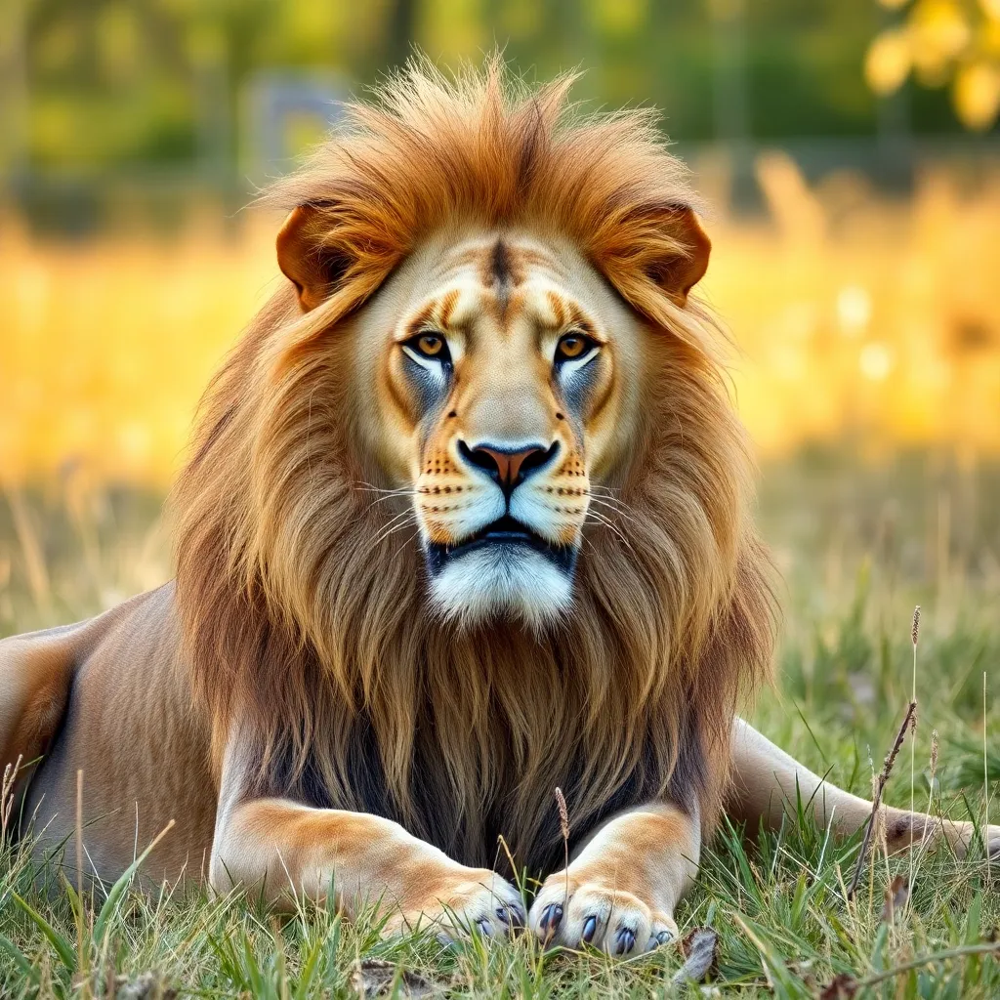

| Before | After |
|--------|-------|
|  |  |


Silly demo using replicate functions to ✨accessorize✨ a subject. To accessorize, run:
```
python predict.py --image path_to_image.png
```

It uses `yorickvp/llava-13b` to name the subject, and choose a fitting accessory for them. Then, it uses `stability-ai/stable-diffusion-3.5-large` to make the accessory. Finally it uses `schananas/grounded_sam` to segment out the manifested accessory, which is then blended into the original image.
